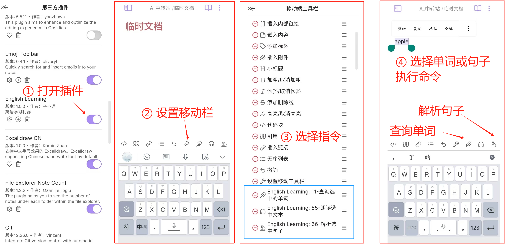

# Obsidian 英语词典插件

## 功能说明

我自己在使用obsidian进行英文阅读的过程中，感觉到诸多不便，

主要包括：

- obsidian本身没有词典查询功能，需要依赖插件；
- 80%的词典插件需要联网，但我又习惯在阅读时完全断网；
- 在查询单词之后，如果想要对该单词做一些笔记，需要手动复制，非常繁琐；
- 在阅读的过程中，如果要用AI对英文句子进行翻译或解析，需要到别的界面去完成。
- 没有适配iPad、安卓等全平台的插件。

于是，就萌生了自己写一个词典插件的想法。

本插件实现了以下功能：

- 单词离线查询，自动创建单词笔记，自动双链；
- 词根词缀查询；
- 快速为单词添加音标；
- AI问答；
- AI解析文本；
- 中英文的配音；

这个插件在iPad、安卓、window、Mac等版本的Obsidian都可以使用。

### 更新记录

- 20250322
  - `版本1.3.4`
  - 修复路径设置bug；
  - 右键菜单开放自定义；
  - 完成文本转语音功能，分免费的微软逆向引擎和付费的MinMax引擎；
- 20250319
  - 初始版本；

## 功能演示

### 单词查询

### 词根查询

### AI解析

## 插件下载

**Gitee地址：**

https://gitee.com/zibuyu2015831/obsidian-learning-english

（点击下方“阅读原文”可跳转）

**Github地址：**

https://github.com/zibuyu2015831/obsidian-english-learning

---

百度网盘链接:

https://pan.baidu.com/s/1zcIbLNtCzClSPqSIq1RZRA?pwd=5an8

夸克网盘链接：

https://pan.quark.cn/s/412b78e54631

123网盘链接：

https://www.123865.com/s/j6a3jv-eodAh

---

这个插件由于携带词典数据，因此体积比较大，一共有 `365M`。

其中，目录下的 `dict/` 文件夹里存放着字典数据，不可或缺。

## 安卓端使用

iPad和IOS的操作与之类似。

## 激活流程

由于本插件的词典数据在整理和设计上花费了很多精力，

因此本插件为收费插件，下载后需要激活才能使用。

目前售价：￥15。

> 会随着数据的完善而涨价，计划添加词组查询功能。

激活流程：

1. 关注公众号【思维兵工厂】，发送【专属码】，获取账号专属码；
2. 联系作者登记专属码（微信号：zibuyu2015831）；
3. 将专属码填写到设置界面，激活软件。

> 注意：
>
> 激活过程需要联网；激活之后就可以永久本地使用了。
>
> 为了防止插件被盗卖，一个专属码激活10个obsidian仓库后就会失效；
>
> 如果你的obsidian仓库确实超过10个，可以联系作者增加额度。

前500个付费用户，将持续享受更新服务：本插件的任何版本更新，都可第一时间使用。

## 联系作者

微信：zibuyu2015831

邮箱：zibuyu2015831@qq.com

公众号：思维兵工厂

## 词典数据

- 以COCA60000（美国当代语料库词频前6万）为基础；经过去重得到 `41654` 词条；
- 补充 柯林斯词典 和 牛津高阶英汉词典中的单词（去除了词组部分）；得到 `49261` 词条；
- 花重金调用通义千问的 `qwen-max` 模型，搭配互联网搜索，为每个单词生成解析，

> 每个单词内容包括：
>
> 1. 英文释义
>
> 2. 中文释义
>
> 3. 词源分析
>
> 4. 文化分析
>
> 5. 构词法分析
>
> 6. 记忆提示
>
> 7. 重难点拆解
>
> 8. 初、中、高三个等级的例句
>
> 同时，每个例句配备了翻译和解析。

- 对有道进行爬虫，补充单词的变形（复数形式、过去式、过去分词、现在分词、比较级、最高级等形式）和音标；

## 后续计划

- [x] 增加英语配音功能：已完成，分免费的微软逆向引擎和付费的MinMax引擎；
- [ ] 增加单词导出功能；
- [ ] 英文阅读材料订阅；
- [ ] 扩充柯林斯、牛津、朗文词典；
- [ ] 与language learner插件联动；
- [ ] 扩充词组查询；

